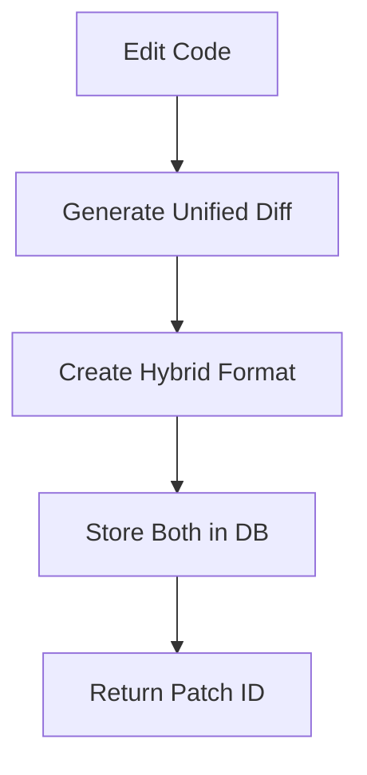
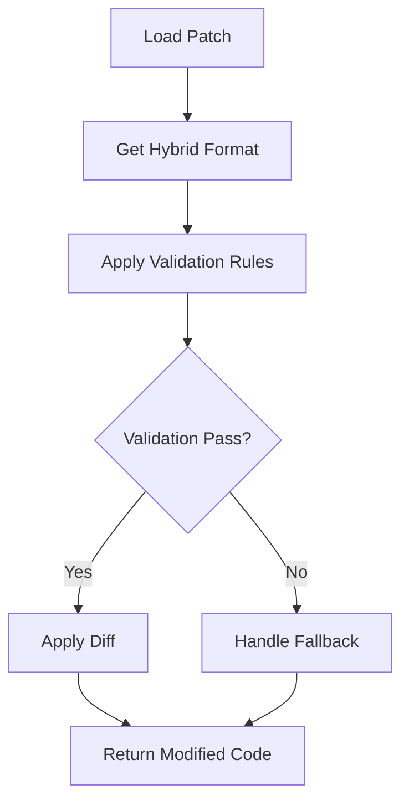

# Hybrid Patch System: Dual Format Approach

When we edit code, the system automatically generates **both** the raw unified diff and the hybrid patch format with metadata. This ensures we have both the technical diff representation and the rich metadata needed for safe patch application.

## Example: Code Edit Flow

### 1. Original Code
```javascript
function calculatePrice(price) {
  return price * 1.1; // 10% tax
}
```

### 2. Modified Code  
```javascript
function calculatePrice(price) {
  return price * 1.05; // 5% tax
}
```

### 3. Generated Unified Diff
```diff
--- original.js
+++ modified.js
@@ -1,3 +1,3 @@
 function calculatePrice(price) {
-  return price * 1.1; // 10% tax
+  return price * 1.05; // 5% tax
 }
```

### 4. Generated Hybrid Patch Format
```json
{
  "patch_type": "diff",
  "diff": "--- original.js\n+++ modified.js\n@@ -1,3 +1,3 @@\n function calculatePrice(price) {\n-  return price * 1.1; // 10% tax\n+  return price * 1.05; // 5% tax\n }",
  "fallback_strategy": "skip_on_conflict",
  "validation_rules": {
    "must_contain": ["function calculatePrice"],
    "cannot_contain": ["process.exit", "eval("],
    "syntax_valid": true,
    "preserve_functions": ["calculatePrice"]
  },
  "safety_checks": {
    "check_syntax": true,
    "prevent_infinite_loops": true,
    "block_dangerous_apis": true,
    "validate_imports": true
  },
  "metadata": {
    "original_patch_type": "hybrid",
    "file_path": "src/utils/pricing.js",
    "url_pattern": "/products/*",
    "created_at": "2024-01-15T10:30:00.000Z",
    "checksum": "a1b2c3d4e5f6...",
    "file_type": "javascript"
  }
}
```

## Storage Strategy

### Database Storage
```sql
INSERT INTO patch_diffs (
  unified_diff,           -- Raw diff for git compatibility
  patch_type,            -- 'hybrid', 'modify', 'override'
  validation_rules,      -- JSON with validation rules
  safety_checks,         -- JSON with safety configuration
  fallback_strategy,     -- Conflict resolution strategy
  application_metadata   -- Contains the full hybrid patch format
) VALUES (
  'diff content here',
  'hybrid',
  '{"must_contain": ["function calculatePrice"]}',
  '{"check_syntax": true}',
  'skip_on_conflict',
  '{"hybrid_patch": {... full hybrid format ...}}'
);
```

### What Gets Stored
1. **Raw unified diff** - For git compatibility and basic patch application
2. **Individual metadata fields** - For efficient querying and filtering
3. **Complete hybrid patch format** - In application_metadata for full context

## API Usage Examples

### Create Patch (Auto-generates both formats)
```javascript
POST /api/flexible-patches/create
{
  "storeId": "store-123",
  "filePath": "src/utils/pricing.js",
  "originalCode": "function calculatePrice(price) {\n  return price * 1.1;\n}",
  "modifiedCode": "function calculatePrice(price) {\n  return price * 1.05;\n}",
  "patchName": "Reduce tax rate",
  "validation_rules": {
    "must_contain": ["function calculatePrice"],
    "cannot_contain": ["process.exit"]
  }
}

// Response
{
  "success": true,
  "patchId": "patch-456",
  "patchType": "hybrid",
  "message": "hybrid patch created successfully"
}
```

### Get Raw Patch Details
```javascript
GET /api/flexible-patches/patch-456

// Response - includes raw unified_diff and parsed metadata
{
  "success": true,
  "patch": {
    "id": "patch-456",
    "unified_diff": "--- original.js\n+++ modified.js\n...",
    "patch_type": "hybrid",
    "validation_rules": {"must_contain": ["function calculatePrice"]},
    "safety_checks": {"check_syntax": true},
    "fallback_strategy": "skip_on_conflict"
  }
}
```

### Get Hybrid Patch Format
```javascript
GET /api/flexible-patches/patch-456/hybrid

// Response - the standardized hybrid format ready for application
{
  "success": true,
  "hybridPatch": {
    "patch_type": "diff",
    "diff": "--- original.js\n+++ modified.js\n@@ -1,3 +1,3 @@...",
    "fallback_strategy": "skip_on_conflict", 
    "validation_rules": {
      "must_contain": ["function calculatePrice"],
      "cannot_contain": ["process.exit"],
      "syntax_valid": true
    },
    "metadata": {
      "original_patch_type": "hybrid",
      "file_path": "src/utils/pricing.js",
      "checksum": "a1b2c3d4e5f6...",
      "created_at": "2024-01-15T10:30:00.000Z"
    }
  },
  "message": "Hybrid patch format with diff + metadata"
}
```

## Application Flow

### 1. Create Patch


### 2. Apply Patch  


## Benefits of Dual Format

### 1. **Compatibility**
- Raw unified diff works with standard git tools
- Hybrid format provides rich metadata for applications

### 2. **Safety**
- Validation rules prevent dangerous code changes
- Fallback strategies handle conflicts gracefully
- Safety checks protect against common vulnerabilities

### 3. **Flexibility**
- Support multiple patch input formats (modify, override, etc.)
- Auto-normalize to consistent storage format
- Easy to extend with new validation rules

### 4. **Performance**
- Efficient querying with individual metadata fields
- Complete hybrid format available when needed
- AST diffs for JavaScript-specific operations

### 5. **Auditability**
- Complete change history with metadata
- Validation results tracked per application
- Clear fallback strategy documentation

## Real-world Examples

### E-commerce Price Update
```json
{
  "patch_type": "diff",
  "diff": "...", 
  "validation_rules": {
    "must_contain": ["calculatePrice", "return"],
    "cannot_contain": ["eval", "process.exit"],
    "preserve_functions": ["calculatePrice", "formatPrice"]
  },
  "safety_checks": {
    "check_syntax": true,
    "prevent_infinite_loops": true,
    "validate_ast_changes": true
  },
  "metadata": {
    "business_impact": "pricing_change",
    "requires_approval": true,
    "rollback_plan": "revert_to_previous_rate"
  }
}
```

### Security Hotfix
```json
{
  "patch_type": "diff",
  "diff": "...",
  "fallback_strategy": "force_apply", // Critical security fix
  "validation_rules": {
    "cannot_contain": ["innerHTML =", "eval(", "dangerouslySetInnerHTML"],
    "must_contain": ["sanitize", "escape"]
  },
  "safety_checks": {
    "prevent_xss": true,
    "block_dangerous_apis": true,
    "validate_imports": true
  },
  "metadata": {
    "severity": "critical",
    "security_fix": true,
    "cve_reference": "CVE-2024-XXXX"
  }
}
```

This dual-format approach ensures we have both the technical precision of unified diffs and the safety/metadata richness needed for production patch application systems.