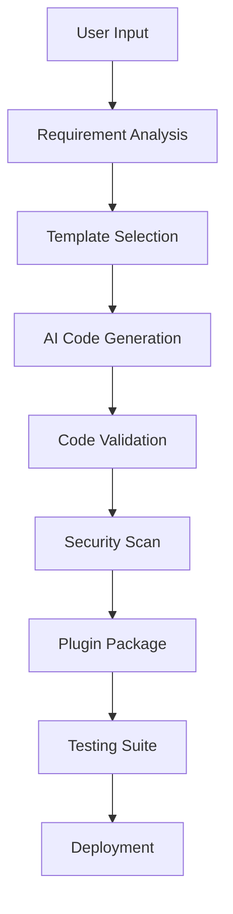

# AI-Generated Plugin Architecture for DainoStore

## Overview

This document outlines the architecture for AI-generated plugins, enabling users to create custom plugins through natural language descriptions. This system will integrate with services like Claude, GPT-4, and other AI models to generate code, similar to platforms like Lovable and Base44.

## 1. AI Plugin Generation Workflow



### Step-by-Step Process

1. **User Input Processing**
   - Natural language description
   - Feature requirements
   - Integration preferences
   - Design mockups (optional)

2. **AI-Powered Code Generation**
   - Select appropriate templates
   - Generate plugin code
   - Create database migrations
   - Build admin interfaces
   - Generate tests

3. **Quality Assurance**
   - Automated code review
   - Security vulnerability scanning
   - Performance optimization
   - Compatibility testing

## 2. AI Service Integration

### Core AI Service Manager

```javascript
class AIPluginService {
  constructor() {
    this.providers = {
      claude: new ClaudeService(),
      openai: new OpenAIService(),
      local: new LocalLLMService()
    };
    this.activeProvider = 'claude'; // Default
    this.templates = new TemplateManager();
    this.validator = new CodeValidator();
  }

  async generatePlugin(userPrompt, options = {}) {
    // 1. Analyze user requirements
    const analysis = await this.analyzeRequirements(userPrompt);
    
    // 2. Select best template
    const template = await this.templates.selectTemplate(analysis);
    
    // 3. Generate code using AI
    const generatedCode = await this.generateCode(template, analysis, options);
    
    // 4. Validate and optimize
    const validatedCode = await this.validator.validate(generatedCode);
    
    // 5. Package as plugin
    return this.packagePlugin(validatedCode, analysis);
  }

  async analyzeRequirements(prompt) {
    const analysisPrompt = `
    Analyze this plugin request and extract key information:
    
    User Request: "${prompt}"
    
    Please identify:
    1. Plugin type (payment, shipping, analytics, etc.)
    2. Required features and functionality
    3. Database requirements
    4. API integrations needed
    5. UI components required
    6. Security considerations
    7. Performance requirements
    
    Respond in JSON format:
    `;
    
    const response = await this.providers[this.activeProvider].complete({
      prompt: analysisPrompt,
      maxTokens: 1000,
      temperature: 0.1
    });
    
    return JSON.parse(response);
  }
}
```

### AI Provider Implementations

```javascript
// Claude Integration
class ClaudeService {
  constructor() {
    this.apiKey = process.env.CLAUDE_API_KEY;
    this.model = 'claude-3-sonnet-20240229';
  }

  async complete(options) {
    const response = await fetch('https://api.anthropic.com/v1/messages', {
      method: 'POST',
      headers: {
        'Content-Type': 'application/json',
        'X-API-Key': this.apiKey,
        'anthropic-version': '2023-06-01'
      },
      body: JSON.stringify({
        model: this.model,
        max_tokens: options.maxTokens || 4000,
        temperature: options.temperature || 0.1,
        messages: [{
          role: 'user',
          content: options.prompt
        }]
      })
    });
    
    const data = await response.json();
    return data.content[0].text;
  }
}

// OpenAI Integration
class OpenAIService {
  constructor() {
    this.apiKey = process.env.OPENAI_API_KEY;
    this.model = 'gpt-4';
  }

  async complete(options) {
    const response = await fetch('https://api.openai.com/v1/chat/completions', {
      method: 'POST',
      headers: {
        'Content-Type': 'application/json',
        'Authorization': `Bearer ${this.apiKey}`
      },
      body: JSON.stringify({
        model: this.model,
        messages: [{
          role: 'user',
          content: options.prompt
        }],
        max_tokens: options.maxTokens || 4000,
        temperature: options.temperature || 0.1
      })
    });
    
    const data = await response.json();
    return data.choices[0].message.content;
  }
}
```

## 3. Plugin Template System

### Template Categories

```javascript
const PLUGIN_TEMPLATES = {
  'payment-gateway': {
    name: 'Payment Gateway',
    description: 'Process payments through external providers',
    requiredMethods: ['processPayment', 'refund', 'webhook'],
    boilerplate: 'templates/payment-gateway/',
    hooks: ['order.payment', 'payment.success', 'payment.failed'],
    database: ['payments', 'transactions', 'payment_methods'],
    apis: ['payment-provider'],
    ui: ['checkout-form', 'payment-settings', 'transaction-history']
  },
  
  'analytics': {
    name: 'Analytics & Tracking',
    description: 'Track user behavior and generate insights',
    requiredMethods: ['track', 'report', 'analyze'],
    boilerplate: 'templates/analytics/',
    hooks: ['page.view', 'product.view', 'order.complete'],
    database: ['events', 'metrics', 'reports'],
    apis: ['analytics-service'],
    ui: ['dashboard', 'reports', 'settings']
  },
  
  'inventory-management': {
    name: 'Inventory Management',
    description: 'Manage stock levels and notifications',
    requiredMethods: ['updateStock', 'checkAvailability', 'reorder'],
    boilerplate: 'templates/inventory/',
    hooks: ['product.sold', 'stock.low', 'reorder.needed'],
    database: ['inventory', 'stock_movements', 'suppliers'],
    apis: ['inventory-system'],
    ui: ['stock-levels', 'reorder-points', 'supplier-management']
  },
  
  'marketing-automation': {
    name: 'Marketing Automation',
    description: 'Automated email campaigns and customer segmentation',
    requiredMethods: ['sendCampaign', 'segmentCustomers', 'trackConversion'],
    boilerplate: 'templates/marketing/',
    hooks: ['customer.registered', 'order.abandoned', 'purchase.complete'],
    database: ['campaigns', 'segments', 'email_logs'],
    apis: ['email-service', 'crm'],
    ui: ['campaign-builder', 'segment-editor', 'analytics-dashboard']
  }
};
```

### Dynamic Template Selection

```javascript
class TemplateManager {
  async selectTemplate(analysis) {
    const { pluginType, features, complexity } = analysis;
    
    // Find best matching template
    let bestMatch = null;
    let bestScore = 0;
    
    for (const [key, template] of Object.entries(PLUGIN_TEMPLATES)) {
      const score = this.calculateTemplateScore(template, analysis);
      if (score > bestScore) {
        bestScore = score;
        bestMatch = { key, ...template };
      }
    }
    
    // If no good match, create custom template
    if (bestScore < 0.6) {
      bestMatch = await this.createCustomTemplate(analysis);
    }
    
    return bestMatch;
  }

  calculateTemplateScore(template, analysis) {
    let score = 0;
    
    // Check plugin type match
    if (template.name.toLowerCase().includes(analysis.pluginType)) {
      score += 0.4;
    }
    
    // Check feature overlap
    const featureOverlap = this.calculateFeatureOverlap(
      template.requiredMethods, 
      analysis.features
    );
    score += featureOverlap * 0.3;
    
    // Check API requirements
    const apiMatch = this.checkApiCompatibility(template.apis, analysis.integrations);
    score += apiMatch * 0.3;
    
    return score;
  }
}
```

## 4. Code Generation Engine

### Context-Aware Prompt Building

```javascript
class CodeGenerator {
  async generatePluginCode(template, analysis, examples) {
    const prompt = this.buildGenerationPrompt(template, analysis, examples);
    
    const generatedFiles = {};
    
    // Generate main plugin file
    generatedFiles['index.js'] = await this.generateMainFile(prompt, template);
    
    // Generate manifest
    generatedFiles['manifest.json'] = await this.generateManifest(analysis);
    
    // Generate database migrations
    if (analysis.database) {
      generatedFiles['migrations/'] = await this.generateMigrations(analysis.database);
    }
    
    // Generate UI components
    if (analysis.ui) {
      generatedFiles['components/'] = await this.generateUIComponents(analysis.ui);
    }
    
    // Generate tests
    generatedFiles['tests/'] = await this.generateTests(template, analysis);
    
    return generatedFiles;
  }

  buildGenerationPrompt(template, analysis, examples) {
    return `
    Generate a complete e-commerce plugin with the following specifications:
    
    ## Plugin Requirements
    ${JSON.stringify(analysis, null, 2)}
    
    ## Template Base
    ${JSON.stringify(template, null, 2)}
    
    ## Example Plugins
    ${examples.map(ex => `
    ### ${ex.name}
    \`\`\`javascript
    ${ex.code}
    \`\`\`
    `).join('\n')}
    
    ## Requirements
    1. Extend the Plugin base class
    2. Implement all required methods: ${template.requiredMethods.join(', ')}
    3. Include proper error handling and logging
    4. Follow security best practices
    5. Include TypeScript-style JSDoc comments
    6. Implement all database operations using Sequelize
    7. Create responsive React components for UI
    8. Include comprehensive test coverage
    
    ## Code Structure
    Generate the following files:
    - index.js (main plugin class)
    - manifest.json (plugin metadata)
    - migrations/ (database schema)
    - components/ (React UI components)
    - tests/ (Jest test files)
    - README.md (documentation)
    
    Focus on clean, maintainable code that follows the existing codebase patterns.
    `;
  }
}
```

## 5. Advanced AI Features

### Intelligent Code Completion

```javascript
class IntelligentCodeCompletion {
  async suggestImprovements(pluginCode, context) {
    const suggestions = [];
    
    // Performance optimizations
    const perfSuggestions = await this.analyzePerformance(pluginCode);
    suggestions.push(...perfSuggestions);
    
    // Security improvements
    const securitySuggestions = await this.analyzeSecurity(pluginCode);
    suggestions.push(...securitySuggestions);
    
    // Code quality improvements
    const qualitySuggestions = await this.analyzeCodeQuality(pluginCode);
    suggestions.push(...qualitySuggestions);
    
    return suggestions;
  }

  async generateOptimizedVersion(pluginCode, suggestions) {
    const optimizationPrompt = `
    Improve this plugin code based on the following suggestions:
    
    Original Code:
    ${pluginCode}
    
    Suggestions:
    ${suggestions.map(s => `- ${s.type}: ${s.message}`).join('\n')}
    
    Generate an optimized version that:
    1. Implements all suggested improvements
    2. Maintains the same functionality 
    3. Improves performance where possible
    4. Enhances security
    5. Follows best practices
    `;
    
    return await this.aiService.complete({
      prompt: optimizationPrompt,
      temperature: 0.1
    });
  }
}
```

### Natural Language Plugin Updates

```javascript
class PluginUpdateService {
  async updatePluginFromDescription(pluginName, updateDescription) {
    const plugin = await this.pluginManager.getPlugin(pluginName);
    const currentCode = await this.readPluginCode(plugin.pluginPath);
    
    const updatePrompt = `
    Update this existing plugin based on the user's request:
    
    Current Plugin Code:
    ${currentCode}
    
    Update Request: "${updateDescription}"
    
    Generate the updated code that:
    1. Implements the requested changes
    2. Maintains backward compatibility where possible
    3. Updates the version number appropriately
    4. Includes migration scripts if database changes are needed
    5. Updates tests to cover new functionality
    
    Return the complete updated plugin files.
    `;
    
    const updatedCode = await this.aiService.complete({
      prompt: updatePrompt,
      temperature: 0.1
    });
    
    return this.packageUpdate(plugin, updatedCode);
  }
}
```

## 6. User Interface for AI Plugin Generation

### Natural Language Plugin Builder

```jsx
// AI Plugin Generator Component
import React, { useState } from 'react';

export default function AIPluginGenerator() {
  const [description, setDescription] = useState('');
  const [generating, setGenerating] = useState(false);
  const [generatedPlugin, setGeneratedPlugin] = useState(null);

  const handleGenerate = async () => {
    setGenerating(true);
    try {
      const result = await apiClient.request('POST', 'plugins/ai-generate', {
        description,
        options: {
          includeUI: true,
          includeTests: true,
          optimizeForPerformance: true
        }
      });
      
      setGeneratedPlugin(result.plugin);
    } catch (error) {
      alert('Failed to generate plugin: ' + error.message);
    } finally {
      setGenerating(false);
    }
  };

  return (
    <div className="max-w-4xl mx-auto p-6">
      <h2 className="text-2xl font-bold mb-6">AI Plugin Generator</h2>
      
      <div className="space-y-6">
        {/* Input Section */}
        <div>
          <label className="block text-sm font-medium mb-2">
            Describe your plugin idea
          </label>
          <textarea
            value={description}
            onChange={(e) => setDescription(e.target.value)}
            placeholder="I need a plugin that sends SMS notifications to customers when their orders are shipped. It should integrate with Twilio and include an admin panel to manage templates..."
            className="w-full h-32 p-3 border rounded-lg resize-none"
            disabled={generating}
          />
        </div>

        {/* Examples */}
        <div className="bg-blue-50 p-4 rounded-lg">
          <h3 className="font-medium mb-2">💡 Example Ideas</h3>
          <ul className="text-sm space-y-1 text-blue-700">
            <li>• "Create a loyalty points system that rewards repeat customers"</li>
            <li>• "Build a wishlist feature with email reminders"</li>
            <li>• "Add Instagram product feed integration"</li>
            <li>• "Create a subscription box management system"</li>
          </ul>
        </div>

        {/* Generate Button */}
        <button
          onClick={handleGenerate}
          disabled={generating || !description.trim()}
          className="bg-purple-600 text-white px-6 py-2 rounded-lg disabled:opacity-50"
        >
          {generating ? 'Generating Plugin...' : 'Generate Plugin'}
        </button>

        {/* Generated Plugin Preview */}
        {generatedPlugin && (
          <div className="border rounded-lg p-6">
            <h3 className="text-lg font-medium mb-4">Generated Plugin</h3>
            <div className="space-y-4">
              <div>
                <strong>Name:</strong> {generatedPlugin.name}
              </div>
              <div>
                <strong>Description:</strong> {generatedPlugin.description}
              </div>
              <div>
                <strong>Features:</strong>
                <ul className="list-disc ml-6">
                  {generatedPlugin.features.map((feature, index) => (
                    <li key={index}>{feature}</li>
                  ))}
                </ul>
              </div>
              
              {/* Install Button */}
              <button
                onClick={() => installGeneratedPlugin(generatedPlugin)}
                className="bg-green-600 text-white px-4 py-2 rounded"
              >
                Install Plugin
              </button>
            </div>
          </div>
        )}
      </div>
    </div>
  );
}
```

## 7. Integration with External AI Services

### Multi-Provider Architecture

```javascript
class AIProviderManager {
  constructor() {
    this.providers = new Map();
    this.loadBalancer = new LoadBalancer();
  }

  registerProvider(name, provider) {
    this.providers.set(name, provider);
  }

  async generateCode(prompt, options = {}) {
    // Select best provider based on requirements
    const provider = await this.selectProvider(options);
    
    // Generate with fallback providers
    try {
      return await provider.complete(prompt, options);
    } catch (error) {
      console.warn(`Primary provider failed: ${error.message}`);
      return await this.fallbackGenerate(prompt, options);
    }
  }

  async selectProvider(options) {
    const { 
      codeComplexity = 'medium',
      responseTime = 'normal',
      cost = 'optimal'
    } = options;
    
    // Smart provider selection based on requirements
    if (codeComplexity === 'high') {
      return this.providers.get('claude'); // Best for complex code
    } else if (responseTime === 'fast') {
      return this.providers.get('local'); // Fastest response
    } else {
      return this.providers.get('openai'); // Balanced option
    }
  }
}
```

## 8. Future Enhancements

### 1. Visual Plugin Builder
- Drag-and-drop interface for plugin components
- Visual workflow designer
- Real-time preview of generated code

### 2. Plugin Store with AI Curation
- AI-recommended plugins based on store type
- Automated plugin reviews and ratings
- Smart plugin bundling suggestions

### 3. Collaborative AI Development
- Multi-user plugin development with AI assistance
- Version control integration with AI-generated commit messages
- Automated code review with AI suggestions

### 4. Advanced Training
- Store-specific AI models trained on successful plugins
- Industry-specific plugin generation
- Performance-optimized code generation

## Implementation Timeline

### Phase 1 (Months 1-2): Foundation
- Basic AI service integration (Claude/OpenAI)
- Simple template system
- Core code generation engine

### Phase 2 (Months 3-4): Enhancement
- Advanced template selection
- UI component generation
- Basic plugin testing automation

### Phase 3 (Months 5-6): Polish
- Multi-provider support
- Visual plugin builder
- Advanced optimization features

This AI-powered plugin system will revolutionize how users extend their DainoStore stores, making custom development accessible to non-technical users while maintaining enterprise-grade code quality.